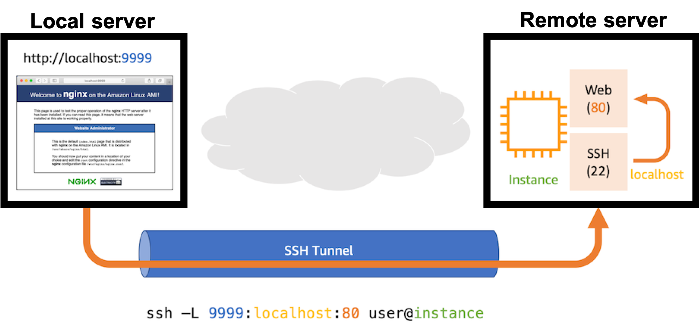

# Create ssh tunnels from the DAQ machine to the DB machine

## What is "ssh tunnel"?



## Create ssh tunnels 
In order to connect to DBs and web applications(mongoDB, influxDB, LocalDB viewer, grafana) in the DB machine from your local machine, Run the following comand on your shell.<br>
**Change the server name accordingly** (e.g.:parrot@localdbserver99)<br> 
Password is the DB server account's password.(Default is "password".)

```bash
# For mongoDB
$ ssh -L 27017:localhost:27017 parrot@localdbserverXX -fN -p22
Password:
# For influxDB
$ ssh -L 8086:localhost:8086 parrot@localdbserverXX -fN
Password:
# For LocalDB viewer
$ ssh -L 5000:localhost:5000 parrot@localdbserverXX -fN
Password:
# For grafana
$ ssh -L 3000:localhost:3000 parrot@localdbserverXX -fN
Password:
```
Go to next step.<br>
[Download module ID infos](database_demonstration_download_itkpd.md)<br>
