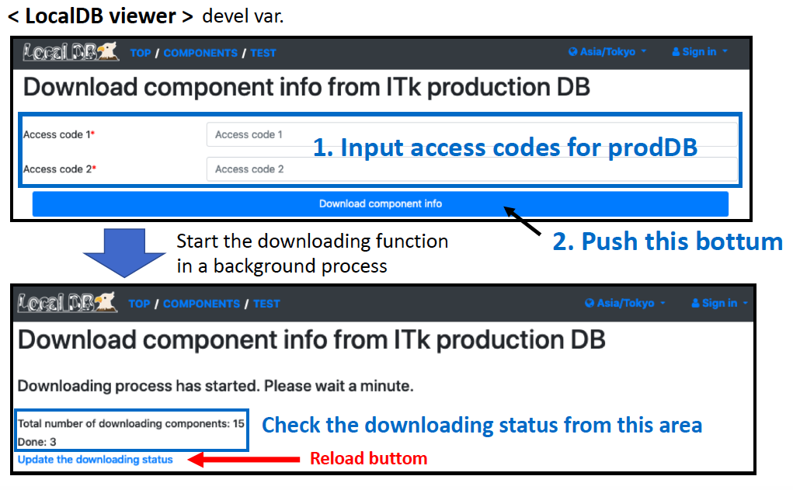
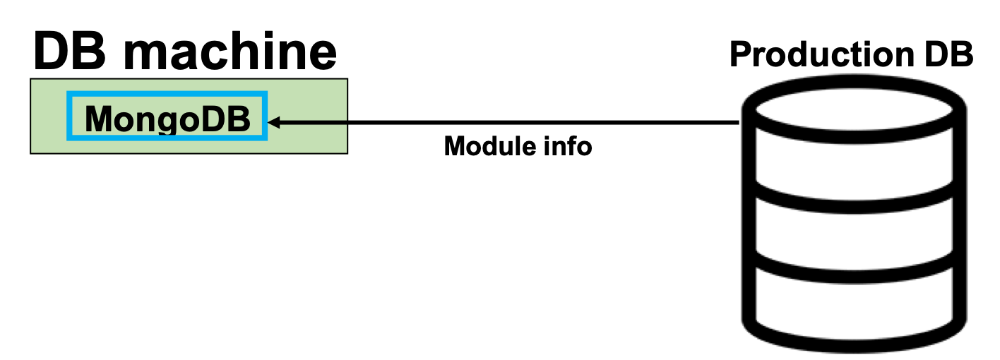

# Download the module ID infos from the Production DB

### Download component information from Production DB 
Download the component data from Production DB. 

Go to the downloading page [http://127.0.0.1:5000/localdb/download_component](http://127.0.0.1:5000/localdb/download_component)  

**Input LocalDB admin's username and password for "Authentication Required".**  

Follow the instruction bellow to download module from prodDB:

You can check the downloaded component data using Viewer Application. 
Check [http://127.0.0.1:5000/localdb/components](http://127.0.0.1:5000/localdb/components) on your browser, 
and you can find the components with ATLAS serial numbers.  

We use an RD53A module's property in this tutorial. 
The device's serial number is "20UPGRS0000009" or "20UPGRS0000010", the chip's serial number is "20UPGRA0000026" or "20UPGRA0000027". Check the information in the viewer.  

Go to next step. 
[Hook-up the module to the devices and Run the DCS controller](database_demonstration_run_dcs.md) 
