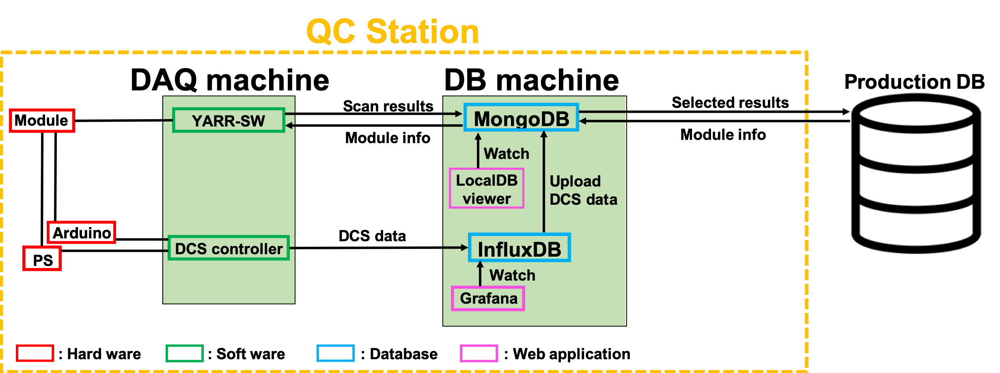
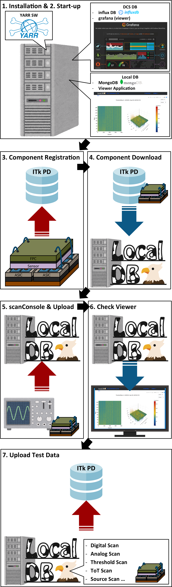

# QC Demonstration

## Structure of SW and DB

Production DB: A central DB for ITk,setup in Czech. 
MongoDB: A local DB to store module info, scan results and so on. 
InfluxDB: A DB dedicated for time series data to store DCS data.  
LocalDB viewer: A web application to see the contents of mongoDB. 
Grafana: A web application to see the contents of influxDB.  

In this tutorial, we suppose we have two machines, a DAQ machine and a DB machine. 
The DAQ machine is the local machine you use in the room.  
Run YARR-SW and DCS controller. Get scan results and DCS data in this machine and send the obtained data to the DB machine. 
The DB machine is a virtual remote machine which store the scan and DCS data. 
MongoDB, InfluxDB and some related services are provided.  
First, we create the environment for the QC tutorial to install the DB and SW for both machines. Then we demonstrate QC procedure according to the tutorial bellow. 

## Tutorial
In this QC demonstration, we can learn the following things:

**The beggining processes**
### 1. Installation for the DB machine
[Installation for the DB machine](database_demonstration_install_db_machine.md) 
[Setting for MongoDB](database_demonstration_mongodb.md) 
[Setting for LocalDB viewer](database_demonstration_viewer.md) 

### 2. Installation for the DAQ machine
[Installation for the DAQ machine](database_demonstration_install_daq_machine.md) 

### 3. Download module ID info from the Production DB
[Download Module ID info](database_demonstration_download_itkpd.md)   

**The processes per module per stage.**
### 4. Setup for the QC scan 
[Hook-up the module to the devices and Run the DCS controller](database_demonstration_run_dcs.md) 
[Retrieve module info and create config files for the scan](database_demonstration_setup_for_scan.md) 

### 5. What to do to run the QC
[What to do for QC scan](database_demonstration_scanconsole.md) 

### 6. Upload scan results to the Production DB 
[Select and Upload results to the Production DB](database_demonstration_upload_itkpd.md) 

## Appendix
1. Document of "Traveling module"[(https://moduledaqdb.readthedocs.io/en/latest/)](https://moduledaqdb.readthedocs.io/en/latest/)
2. Yarr docs[(https://yarr.readthedocs.io/en/latest/)](https://yarr.readthedocs.io/en/latest/)
3. LocalDB docs[(https://localdb-docs.readthedocs.io/en/master/)](https://localdb-docs.readthedocs.io/en/master/)
4. Tutorial page for ITk production DB[(https://gitlab.cern.ch/jpearkes/itkpd_tutorial/blob/master/README.md)](https://gitlab.cern.ch/jpearkes/itkpd_tutorial/blob/master/README.md)
5. Module QC documentation[(https://cds.cern.ch/record/2702738/files/ATL-COM-ITK-2019-045.pdf?)](https://cds.cern.ch/record/2702738/files/ATL-COM-ITK-2019-045.pdf?)
6. MongoDB web[(https://www.mongodb.com)](https://www.mongodb.com)
7. InfluxDB web[(https://www.influxdata.com)](https://www.influxdata.com)
8. Gragfana web[(https://grafana.com)](https://grafana.com)

## Contact
Let me know if you have questions or comments. 
E-mail:hiroki.okuyama at cern.ch 
Mattermost:[https://mattermost.web.cern.ch/yarr/channels/localdb](https://mattermost.web.cern.ch/yarr/channels/localdb)
<!--

-->
