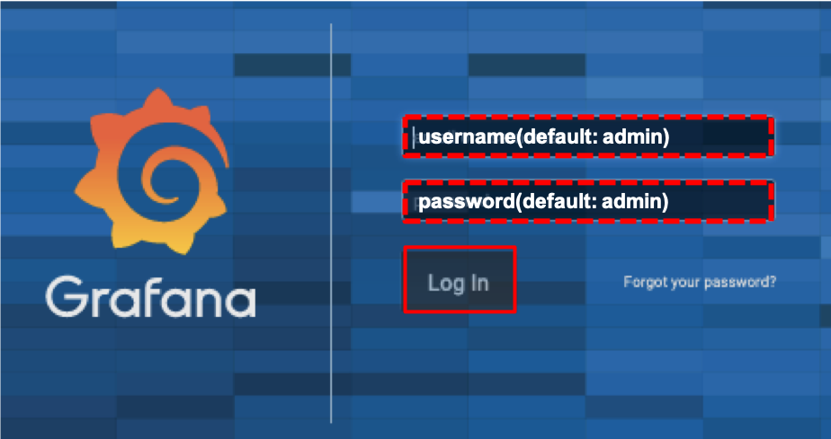
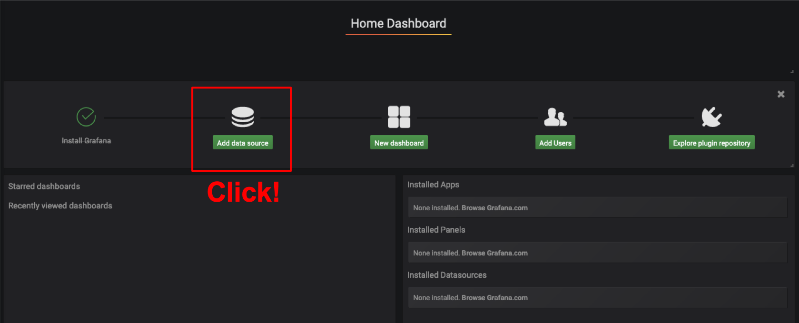
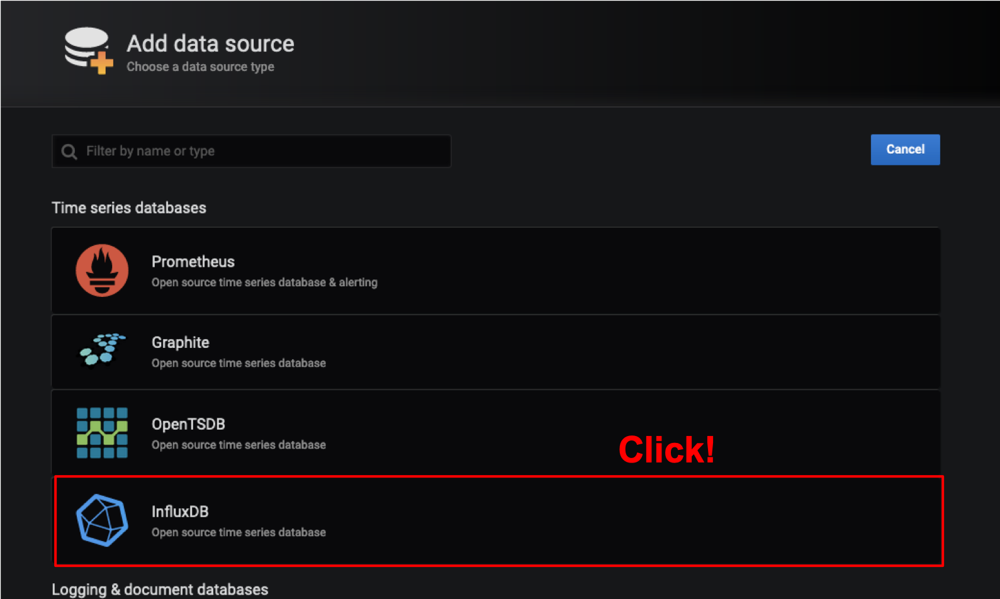
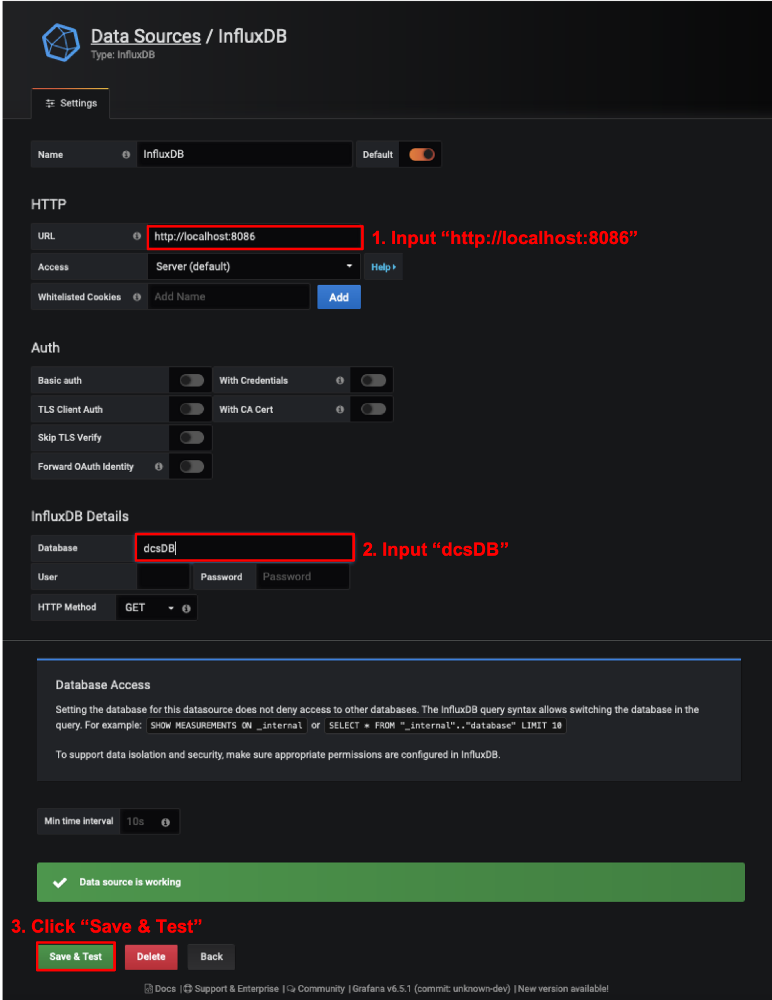
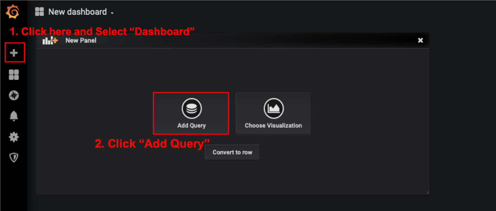
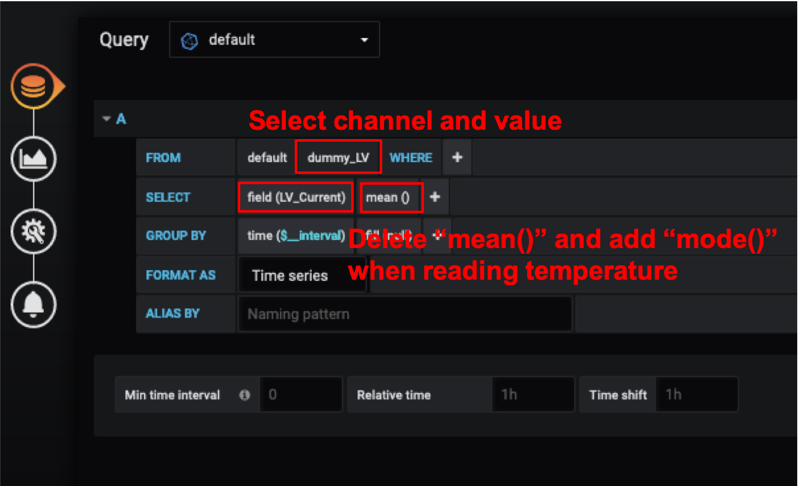

# grafana

### Create an ssh tunnel 
In order to see grafana on your browser, Run the following comand on your shell.<br>
**Change the server name accordingly** (e.g.:root@localdbserver99)<br> 
Password is the DB server account's password.(Default is "password".)

```bash
$ ssh -L 3000:localhost:3000 root@localdbserverXX -fN
Password:
```


### (a) Access to the Web Page

Access to [http://127.0.0.1:3000/](http://127.0.0.1:3000/) with the machine's browser on the same network as DB machine,<br>
and you can see the web page as follows:


### (b) Login

Login with the username: 'admin' and the password: 'admin'


### (c) Add Database Source

1. Click "Add data source"
2. Click "InfluxDB"

<br>


3. Set URL "http://localhost:8086"
4. Set Database "dcsDB"
5. Click "Save & Test"



### (d) Create New Dashboard

1. Click "+"
2. Click "Add Query"



3. Select the measurement channel (e.g. "Tempareture")
4. Select data value from the list (e.g. temp1)



Go to next step.<br>
[scanConsole and tuning](database_demonstration_scanconsole.md)<br>
