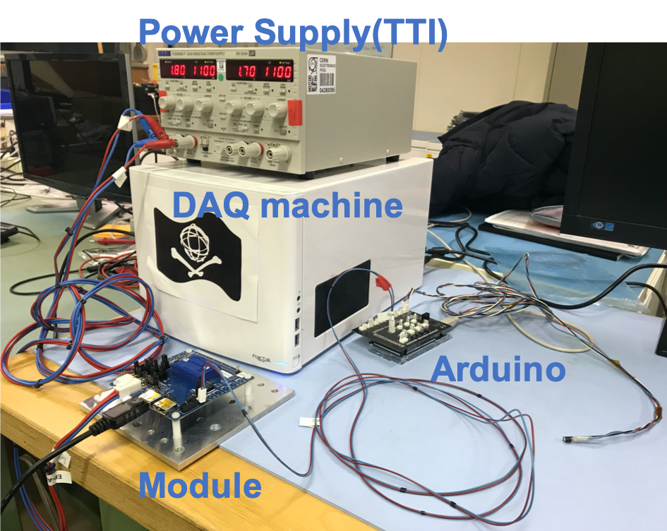
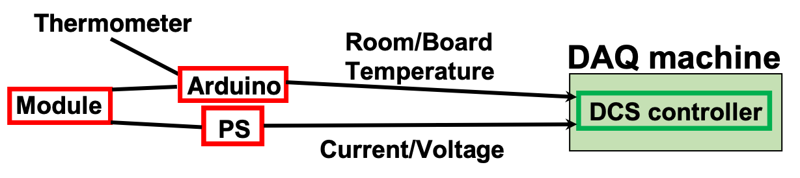
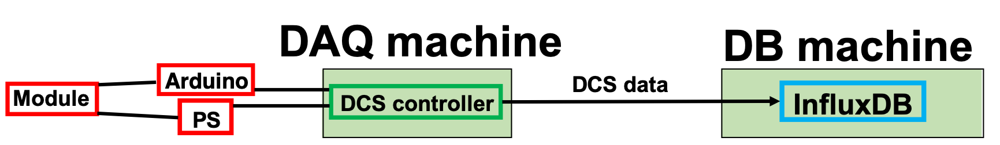

# Hook-up the module to the devices and run the DCS controller

## Hook-up module to devices



## (a) Run a script to get temperature(for monkeyisland)
To get environmental temperature and store the data into influxDB, do the following command.<br>
<span style="color: red; ">**Don't stop this process during the readout process. Switch the shell from the next step.**</span>
<br>
For monkeyisland,
```bash
$ cd ~/work/E4control/e4control
$ python3 temp_controller.py
This measurement runs until ctrl+C is pressed!
Temp1:??.??C     Temp2:??.??C
...
```
"temp_controller" is only for this tutorial. It is not on git repo.

## (b) Run LV IV(for yarrpixdaq)
To run LV IV and get data, do the following command.<br>
```bash
$ cd ~/reference/lowvoltageiv/
$ python makeIVcurve.py
```
You can see the raw data in "IVout_test_0.json".<br>
Create and check the IV plot with the following commands.<br>
```bash
$ python analyzeIV.py -i IVout_test_0 -o test  
$ qpdfview 0x0796_test.png 
```

## (c) Run LV PS controller
To turn on the LV PS and get the current and voltage, do the following command.<br>
<span style="color: red; ">**Don't stop this process during the readout process. Switch the shell from the next step.**</span>
<br>
For monkeyisland,
```bash
$ cd ~/work/E4control/e4control
$ python3 LV_controller.py
This measurement runs until ctrl+C is pressed!
TTI2:
...
```
For yarrpixdaq,
```bash
$ cd ~/reference/lowvoltageiv/
$ python3 LV_controller.py
```

"LV_controller" is only for this tutorial. It is not on git repo.



E4control repo:([https://github.com/sdungs/E4control.git](https://github.com/sdungs/E4control.git))<br>
labremote repo:([https://gitlab.cern.ch/berkeleylab/labRemote.git](https://gitlab.cern.ch/berkeleylab/labRemote.git))<br>
LV IV script repo:([https://gitlab.cern.ch/YARR/utilities/lowvoltageiv.git](https://gitlab.cern.ch/YARR/utilities/lowvoltageiv.git))<br>
These SW does not support the uploading system of the DCS data for influxDB so far.<br>
Create a new DCS or shere these SW to take and store the DCS data.<br>

## The DCS data monitoring in Grafana
Check the DCS data in "Grafana" by following the link bellow.<br>
[Check DCS data in Grafana](database_demonstration_grafana.md)<br>


Go to next step.<br>
[Retrieve module info and create config files for the scan](database_demonstration_setup_for_scan.md)<br>


