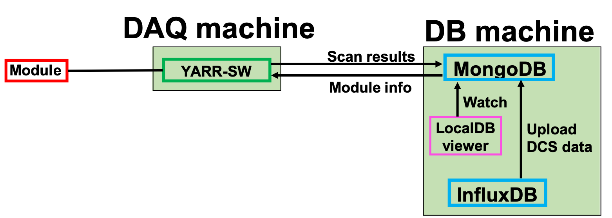

# QC scan

## scanConsole and upload the DCS data

Run the scan using the following command.(e.g. digitalscan) 
```bash
$ ./bin/scanConsole -r configs/controller/specCfg.json -c db-data/connectivity.json -s configs/scans/rd53a/std_digitalscan.json -W
```
Next, run the dbAccessor to upload the DCS data from influxDB to LocalDB:
```bash
$ ./bin/dbAccessor -F localdb/configs/influxdb_connectivity.json -n 20UPGRA0000026 -s data/last_scan/scanLog.json
```
Check the test result and DCS plot from following link [http://127.0.0.1:5000/localdb/scan](http://127.0.0.1:5000/localdb/scan).<br>



Test items for tuning are bellow:<br>
- diff_analogscan<br>
- diff_thresholdscan<br>
- diff_totscan<br>
- diff_tune_globalthreshold<br>
- diff_tune_pixelthreshold<br>
- diff_tune_globalpreamp<br>
- diff_retune_pixelthreshold<br>
- diff_tune_finepixelthreshold<br>
- diff_thresholdscan<br>
- diff_totscan<br>

Do this tuning step for the chip using the following commands as a module QC-minick.<br>
If you want to integrate the DCS data for each scan, put the following command between scans.<br>
"./bin/dbAccessor -F localdb/configs/influxdb_connectivity.json -n 20UPGRA0000026 -s data/last_scan/scanLog.json"

```bash
$ ./bin/scanConsole -r configs/controller/specCfg.json -c db-data/connectivity.json -s configs/scans/rd53a/diff_analogscan.json -W
$ ./bin/scanConsole -r configs/controller/specCfg.json -c db-data/connectivity.json -s configs/scans/rd53a/diff_thresholdscan.json -W
$ ./bin/scanConsole -r configs/controller/specCfg.json -c db-data/connectivity.json -s configs/scans/rd53a/diff_totscan.json -t 10000 -W
$ ./bin/scanConsole -r configs/controller/specCfg.json -c db-data/connectivity.json -s configs/scans/rd53a/diff_tune_globalthreshold.json -t 1500 -W
$ ./bin/scanConsole -r configs/controller/specCfg.json -c db-data/connectivity.json -s configs/scans/rd53a/diff_tune_pixelthreshold.json -t 1500 -W
$ ./bin/scanConsole -r configs/controller/specCfg.json -c db-data/connectivity.json -s configs/scans/rd53a/diff_tune_globalpreamp.json -t 10000 -W
$ ./bin/scanConsole -r configs/controller/specCfg.json -c db-data/connectivity.json -s configs/scans/rd53a/diff_retune_pixelthreshold.json -t 1500 -W
$ ./bin/scanConsole -r configs/controller/specCfg.json -c db-data/connectivity.json -s configs/scans/rd53a/diff_tune_finepixelthreshold.json -t 1500 -W
$ ./bin/scanConsole -r configs/controller/specCfg.json -c db-data/connectivity.json -s configs/scans/rd53a/diff_thresholdscan.json -W
$ ./bin/scanConsole -r configs/controller/specCfg.json -c db-data/connectivity.json -s configs/scans/rd53a/diff_totscan.json -t 10000 -W
```
Check the test results [http://127.0.0.1:5000/localdb/scan](http://127.0.0.1:5000/localdb/scan).<br>

Go to next step.<br>
[Select and Upload results into Production DB](database_demonstration_upload_itkpd.md)<br>

